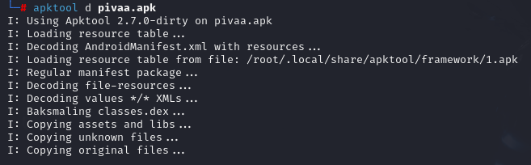
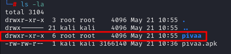
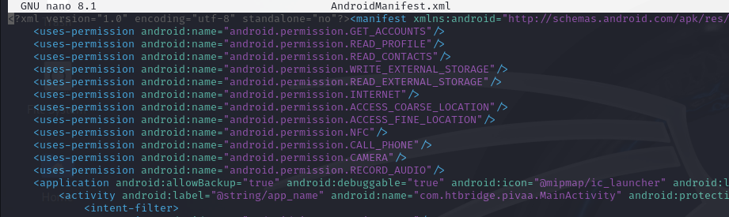
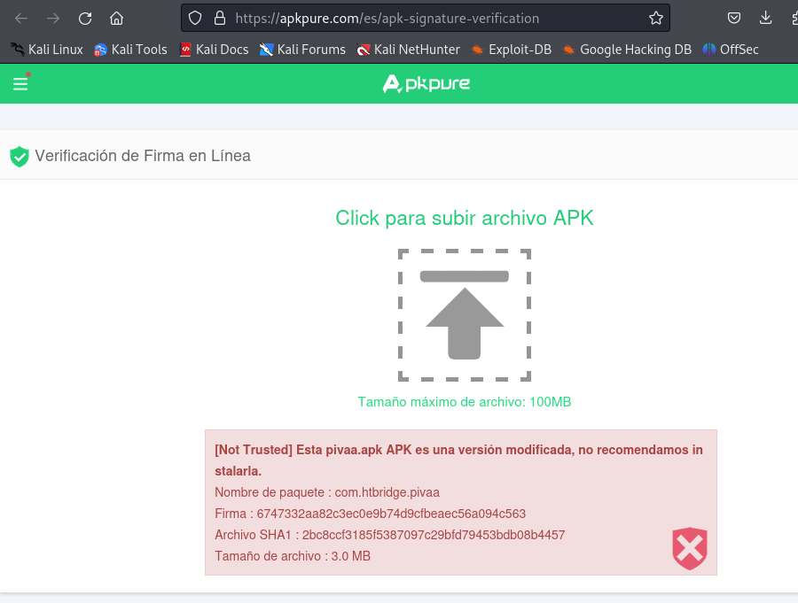
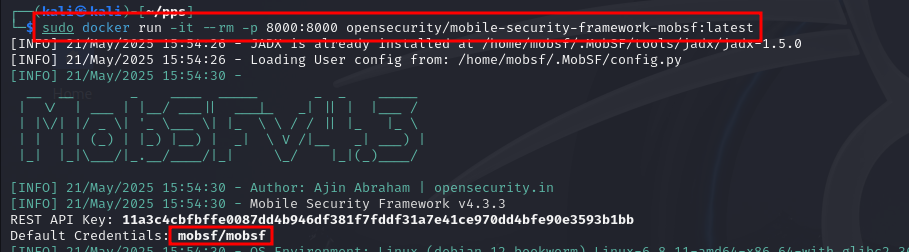
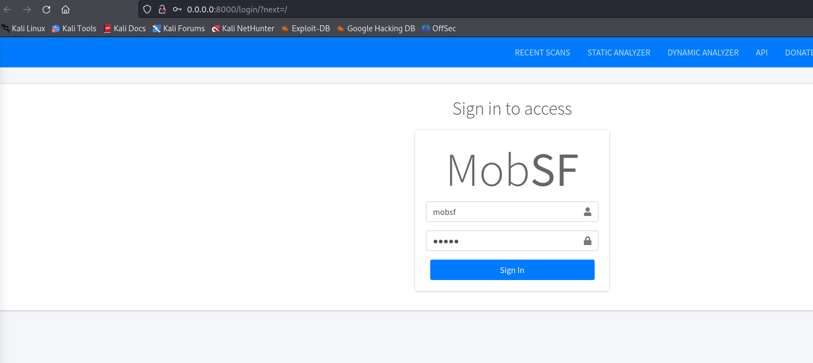
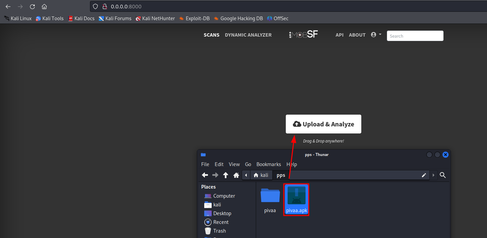
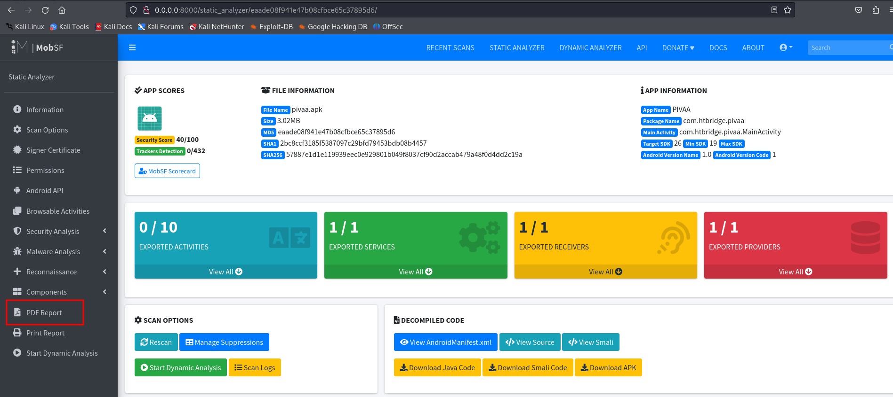
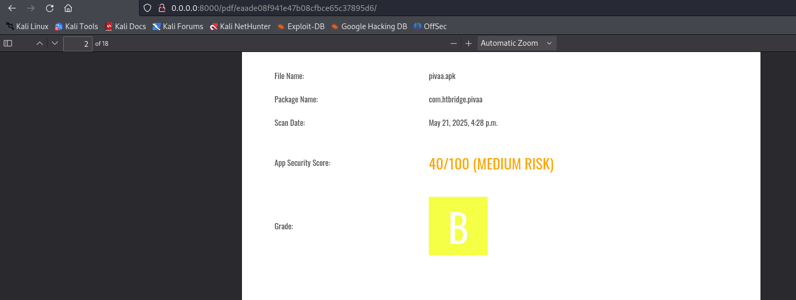

# Análisis estático de apk con MobSF

Lo primero es descargar la apk **Pivaa** y la extraemos con la utilidad **apktool**:

Ya nos genera la carpeta:

Dentro de esta carpeta tenemos el archivo tenemos el fichero de **AndroidManifests.xml** con la lista de permisos que utiliza la aplicación:

Los permisos que requiere son:

- Acceso a la cuenta del usuario
- Permisos de lectura del perfil
- Permisos para leer los contactos
- Permisos de escritura en el almacenamiento
- Permisos de lectura del almacenamiento
- Acceso a internet
- Acceso a la localización tanto aproximada como precisa
- Permisos de NFC
- Acceso a las llamadas
- Acceso a la cámara
- Permisos para grabar audio

[Enlace a la guia completa de permisos de Android](https://developer.android.com/reference/android/Manifest.permission)

Ahora comprobamos si la firma de la aplicación es válida en la página web de **APKPure**

Nos indica que la firma no es válida y que no recomiendan instalarla.

Levantamos una máquina docker con MobSF:

Accedemos desde el navegador con la credenciales **mobsf/mobsf**:

Una vez dentro le adjuntamos el archivo de **pivaa.apk** para realizar el análisis estático de la aplicación:

Una vez realizado el análisis, ya podemos consultar los datos y descargar un informe en pdf:

Dentro del informe podemos ver los resultados de este y vemos que clasifica la aplicación con un riesgo medio:

[Enlace al informe pdf](Informe/informe.pdf)
